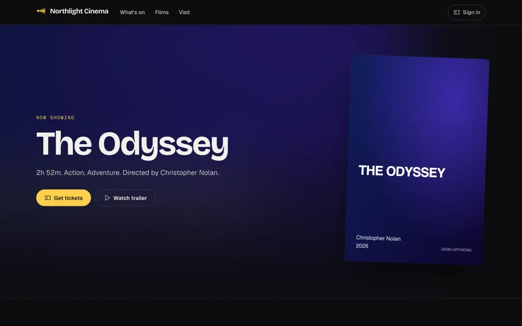
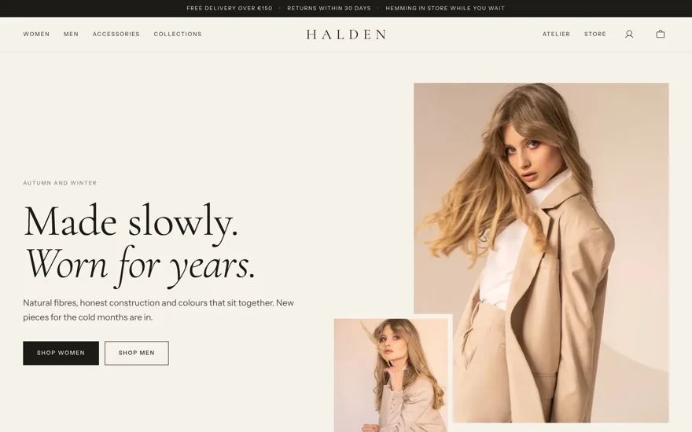
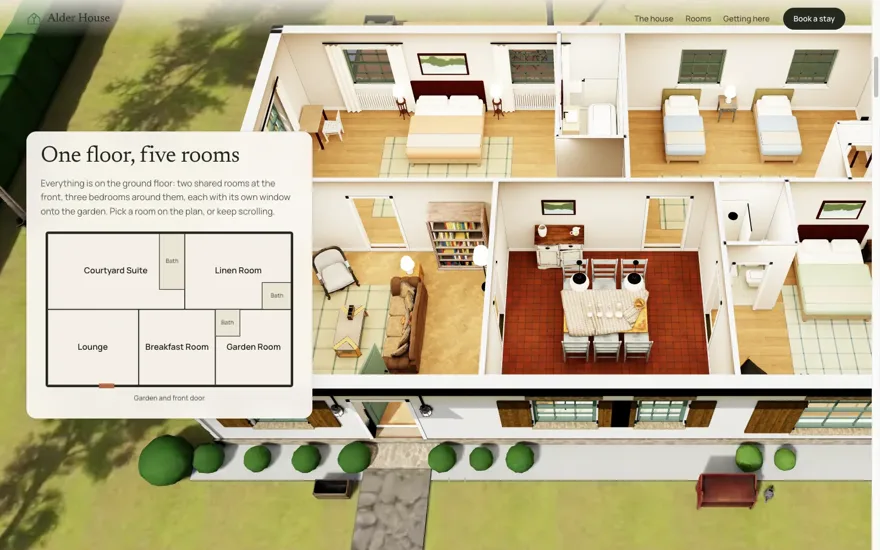
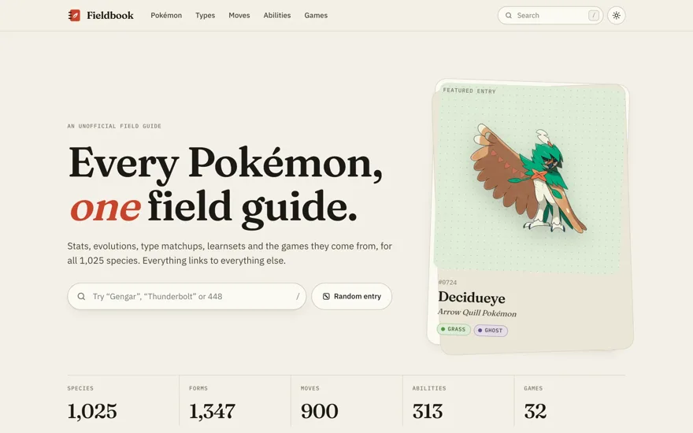
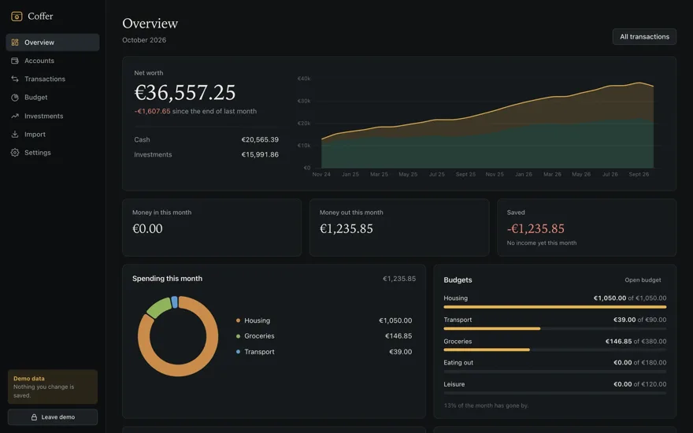
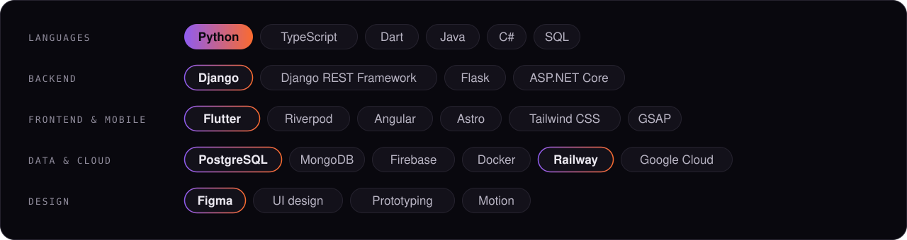

  <a href="https://matteovanzini.dev"><b>Portfolio</b></a>
  &nbsp;·&nbsp;
  <a href="https://www.linkedin.com/in/matteovanzini"><b>LinkedIn</b></a>
  &nbsp;·&nbsp;
  <a href="https://www.fantapredio.com"><b>Fantapredio</b></a>
  &nbsp;·&nbsp;
  <a href="https://github.com/mattoznav/templates"><b>Templates</b></a>

### Hi, I'm Matteo

Software engineer from Modena. I write code, but I think in products: my projects start in Figma and ship as one system, with the app, the API and the back office designed together.

### Templates

Complete products for a kind of business, built to show the method end to end. Brands and data are made up, the code is real and MIT licensed.

<table>
  <tr>
    <td width="50%" valign="top">
      
      <h4>Cinema · Northlight</h4>
      Programme, seat maps, payments and tickets, from the website to the door. 
      Django · Astro · Angular · Flutter · Stripe 
      <a href="https://mattoznav.github.io/templates-cinema-website/">Live site</a> · <a href="https://github.com/mattoznav/templates-cinema">Code</a>
    </td>
    <td width="50%" valign="top">
      
      <h4>Clothing store · Halden</h4>
      An editorial shop with colours, sizes, stock, orders and returns. 
      Django · Astro · Angular · Flutter · Stripe 
      <a href="https://mattoznav.github.io/templates-wardrobe-website/">Live site</a> · <a href="https://github.com/mattoznav/templates-wardrobe">Code</a>
    </td>
  </tr>
  <tr>
    <td width="50%" valign="top">
      
      <h4>Bed &amp; breakfast · Alder House</h4>
      Walk through the house before booking: a 3D tour that follows the scroll, room by room. 
      Astro · React Three Fiber · GSAP · Blender · Python 
      <a href="https://mattoznav.github.io/templates-bnb-website/">Live site</a> · <a href="https://github.com/mattoznav/templates-bnb">Code</a>
    </td>
    <td width="50%" valign="top">
      
      <h4>Wiki · Fieldbook</h4>
      An unofficial field guide to every Pokémon: 2,000 static pages built from PokéAPI. 
      Astro · Flutter · Riverpod · GraphQL 
      <a href="https://mattoznav.github.io/templates-wiki-website/">Live site</a> · <a href="https://github.com/mattoznav/templates-wiki">Code</a>
    </td>
  </tr>
  <tr>
    <td width="50%" valign="top">
      
      <h4>Personal finance · Coffer</h4>
      Accounts, budgets, net worth and investments, encrypted on your own computer. 
      Python · SQLite · pywebview · SvelteKit 
      <a href="https://github.com/mattoznav/templates-finance">Code</a>
    </td>
    <td width="50%" valign="top">
      <h4>More on the way</h4>
      Each template is a family of repos (website, back office, app, API) under one umbrella. Browse them all in <a href="https://github.com/mattoznav/templates">mattoznav/templates</a>.
    </td>
  </tr>
</table>

### Stack

### Get in touch

The quickest way is the contact button on my [portfolio](https://matteovanzini.dev), or a message on [LinkedIn](https://www.linkedin.com/in/matteovanzini).
